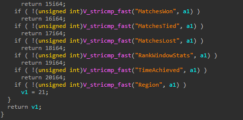

# Counter-Strike 2 Leaderboard Web API

## Endpoints:
- Global: ``https://api.steampowered.com/ICSGOServers_730/GetLeaderboardEntries/v1?format=json&lbname=official_leaderboard_premier_season1``
- Regional: ``https://api.steampowered.com/ICSGOServers_730/GetLeaderboardEntries/v1?format=json&lbname=official_leaderboard_premier_season1_region`` (replace ``region`` with ``NorthAmerica`` / ``SouthAmerica`` / ``Europe`` / ``Asia`` / ``Australia`` / ``Africa`` / ``China`` )
- Friends leaderboard uses internal steam API calls, see (related protobufs)[https://github.com/SteamDatabase/SteamTracking/blob/bdadf0c49d1eb34bdd406d4413a2fb1e90bf2448/Protobufs/steammessages_clientserver_lbs.proto#L49-L69].
## Example result

```json
{
	"result": {
		"data": 267117,
		"entries": [
			{
				"rank": 2,
				"score": 906461930,
				"detailData": "1f2a040810104b2a04081210042a0708131090e6c4082a08081410d4bcdda706",
				"name": "Kurosaki"
			},
			{
				"rank": 3,
				"score": 899482336,
				"detailData": "1e2a04081010472a04081210022a06081310a2c4082a08081410e0fddaa70600",
				"name": "月光"
			}
		]
	}
}
```

## What data is available (and how)
- Name
- Leaderboard size
- Rank (absolute)

- CS Rating = ``score >> 15``
- Data related to ``detailData``:
  - Data is almost a [ScoreLeaderboardData protobuf message](https://github.com/SteamDatabase/Protobufs/blob/a5ca80c0b692dbc379cdb0a25bb7aac05d71180d/csgo/cstrike15_gcmessages.proto#L302-L318). Need to add/remove some bytes for some reason though.
  - In ``matchentries``, each tag corresponds to a certain field, see image below. Winrate is calculated from the win/draw/loss fields.
  
  
  - For ``RankWindowStats``, it corresponds to the map spider graph indicating player's map "preferences" (maybe derived from wins). It's a 32 bit value, each 4 bits correspond to a map.
  - ``TimeAchieved`` is probably when the player gets into the leaderboard.
- Rank% (hidden from cs2 global LB) = `Rank / data`. It's an integer always capped between 1 and 99.
